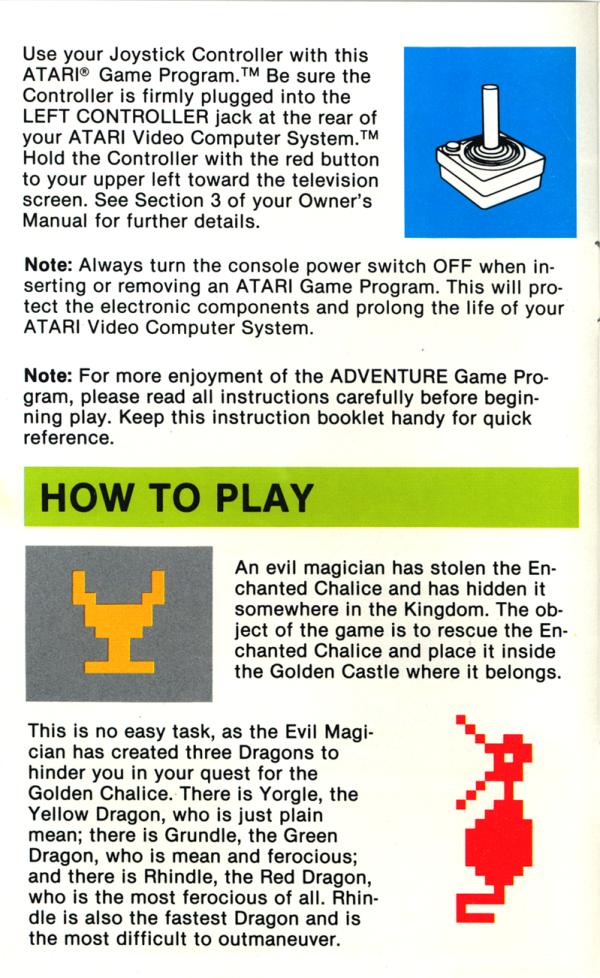

### Minimal documentation

 Keith T. Butler

---
### Minimal Documentation

* What is it
* Good/bad/ugly
* How dow we become minimal

---
### What is minimalism?

* You don't need to document every aspect
* Users can play with the product to discover functionality
* Fewer words improves navigation
* Simple language improves comprehension

---
### Where is the concept from?

* Early documentation tended to be dense text
* Often has the air of a research paper
* 1994 Sun Microsystems example
    * 40% text reduction; users experienced the docs as *more* information rich

---
### Where minimalism fails

* Where users consistently show poor compliance
    * Perhaps concepts are not understood
    * Background documentation helps here
* Unusual products
    * There is a lack of intuitive basis
* Diverse audience, flat documentation
    * Layers of documentation are often needed
    
---
### Compromise

* Do *not* revert to verbose documentation
* Add words carefully
    * Eg "Setting up fitting functions" is better than "Set up"
* Add layers to documentation

---
### Levels of information

* Essential
    * Technical
    * Legal
* Value-added
* Junk drawer

---
### Tips for over-writers

* Write it down first
* Try a readability calculator (e.g. [SMOG readability calculator](http://www.learningandwork.org.uk/SMOG-calculator/smogcalc.php#userguide))
* Target long sentences; break-down, simplify, shorten
* Target long words, simplify
* Look for unnecessary content
* Remove unnecessary repetition

---
### Tips for under-writers

You might skip over some "obvious" steps or logical connections

* Test on another person, make sure they understand what you have written

